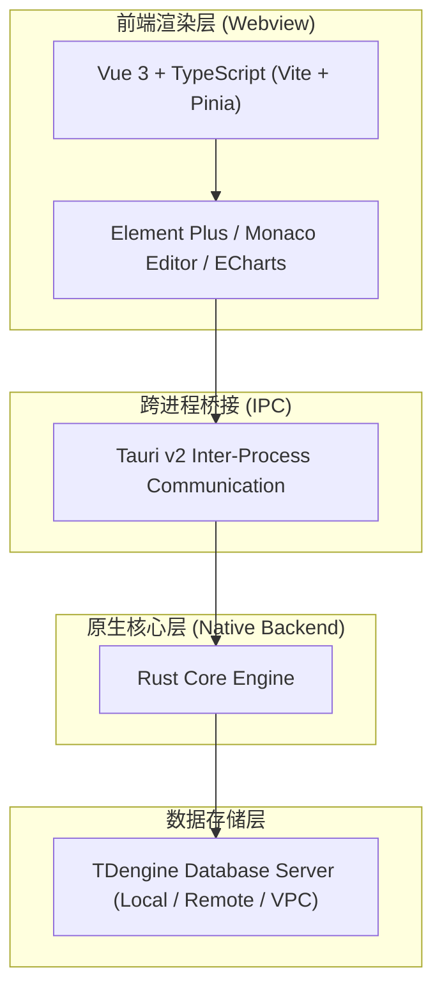

# TD Studio

**A Modern, Free & Local-First TDengine Desktop Client**

一款面向 TDengine 的现代化、轻量级、本地优先的桌面数据库客户端

  🇨🇳 中文 &nbsp;|&nbsp; <a href="README_EN.md">🇺🇸 English</a>

  <a href="https://huangdungui.github.io/TD-Studio-Release/">🌐 官方网站 (Website)</a> &nbsp;•&nbsp;
  <a href="https://huangdungui.github.io/TD-Studio-Release/#section-download">📥 立即下载 (Download)</a> &nbsp;•&nbsp;
  <a href="https://github.com/huangdungui/TD-Studio-Release">📦 发布仓库 (Releases)</a>

---

## 📖 项目介绍

**TD Studio** 是一款专为 **TDengine** 打造的现代化桌面数据库客户端。

针对时序数据日常管理、SQL 查询交互与运维排查的实际场景，TD Studio 致力于提供直观、清爽且高响应速度的桌面操作体验，帮助工程师与开发者更高效地探索和管理 TDengine 数据库。

- **现代化桌面体验**：摒弃传统数据库管理工具厚重的设计风格，采用清爽舒适的现代化界面与交互布局。
- **本地优先架构**：所有数据库交互由本地应用直连完成，不经过任何中间云代理服务，保护数据安全。
- **轻量高效引擎**：采用原生技术栈构建，告别笨重的运行时，降低内存占用与启动耗时。

---

## ✨ Features / 核心功能

* 🖥️ **现代化桌面 UI**：精心设计的暗色与多主题界面，布局合理，层次分明，操作自然流畅。
* 📝 **SQL 查询与执行**：内置专业的 Monaco Editor 代码编辑器，支持语法高亮、多行编写与快捷执行。
* 🗂️ **数据库与表结构浏览**：清晰直观地树状展示数据库、超级表（STable）、普通表、子表及其字段与标签（Tag）元数据。
* 📊 **查询结果展示**：以高性能表格形式查看查询结果，支持时间戳、数值列清晰排版，便于数据比对与排查。
* 💾 **数据快速导出**：支持将 SQL 查询结果或数据表记录一键导出为 CSV 等标准文件格式，便于离线分析。
* 🔌 **多数据库连接管理**：支持维护多个环境（如本地测试、开发集群、生产只读）的 TDengine 实例配置，轻松平滑切换。
* 🚀 **跨平台原生架构**：面向 macOS 与 Windows 平台深度适配，拥有轻快的启动速度与资源利用表现。

---

## 🏗️ Architecture / 技术架构

TD Studio **不使用 Electron**，而是基于 **Tauri v2 + Rust + Vue 3** 现代桌面架构构建。

通过使用操作系统原生 Webview 进行界面渲染，并由 Rust 负责底层系统调用与核心逻辑，在大幅削减应用安装包体积和运行时内存开销的同时，保持了前端生态的灵活性与响应速度。

### 核心技术栈

* **Desktop Framework**：[Tauri v2](https://v2.tauri.app/)
* **System Language**：[Rust](https://www.rust-lang.org/)
* **Frontend Framework**：[Vue 3](https://vuejs.org/) + [TypeScript](https://www.typescriptlang.org/) + [Vite](https://vitejs.dev/)
* **State Management**：[Pinia](https://pinia.vuejs.org/)
* **UI Components**：[Element Plus](https://element-plus.org/)
* **SQL Editor**：[Monaco Editor](https://microsoft.github.io/monaco-editor/)
* **Visualization**：[ECharts](https://echarts.apache.org/)

---

## 🛡️ Local-First & Privacy / 本地优先与隐私

TD Studio 始终坚守“本地优先（Local-First）”的软件架构和对用户数据隐私的尊重：

* **Local-First**：数据库连接与数据传输均在用户本地客户端与目标数据库之间直接发起和完成。
* **No Cloud Proxy**：客户端与 TDengine 之间绝不通过 TD Studio 的任何云端服务器或中间节点代理中转。
* **No Registration**：无需注册账号，下载安装即可直接打开使用。
* **No Login**：无任何登录验证门槛，完全离线可用。
* **No Data Upload**：TD Studio 当前不提供用户数据上传功能，不会将用户的数据库业务数据、SQL 内容或表结构上传到 TD Studio 的服务端。
* **No Tracking**：TD Studio 不以收集用户行为数据、构建用户画像或进行行为分析作为核心功能。

---

## 🆓 Free Forever / 永久免费

**TD Studio 是免费提供使用的闭源软件。**

在当前以及长期的规划中，TD Studio 均不计划通过以下形式进行商业收费：

* ❌ 软件授权费（License Fee）
* ❌ 周期性订阅费（Subscription）
* ❌ 付费专享 Pro / 商业版
* ❌ 核心功能付费解锁
* ❌ 数据库连接数量收费
* ❌ 用户席位与并发限制收费

无论是个人学习、开发者日常调试，还是企业团队的内部使用，**下载、安装与使用 TD Studio 均完全免费**。

---

## 📥 Download / 客户端下载

我们推荐优先前往官方发布站点获取最新安装包：

👉 **[前往 TD Studio 官网下载最新版](https://huangdungui.github.io/TD-Studio-Release/)**

你也可以在当前仓库的 [Releases 页面](https://github.com/huangdungui/TD-Studio-Release/releases) 查看完整发布历史与校验文件。

### 当前支持平台

| 操作系统 | 架构类型 | 安装包格式 | 说明 |
| :--- | :--- | :--- | :--- |
| **macOS** | Apple Silicon (M1/M2/M3/M4 系列芯片) | `.dmg` / `.app.tar.gz` | 原生 ARM64 架构支持 |
| **macOS** | Intel (x86_64) | `.dmg` / `.app.tar.gz` | 兼容传统 Intel 处理器 Mac |
| **Windows** | x64 (64位) | `.exe` (安装引导包) | 适用于 Windows 10 / 11 64 位系统 |

> **提示**：Linux 平台安装包目前尚在测试与完善阶段，暂未在官网正式提供下载，敬请期待后续发布。

---

## 🔄 Automatic Updates / 自动更新

TD Studio 内置了应用内检查更新支持：

* **轻量检查**：客户端支持自动或手动检查最新版本发布动态。
* **平滑升级**：当有新版本发布时，已安装旧版本客户端的用户可通过应用内指引快速下载并完成无缝升级。
* **安全验签**：基于 Tauri Updater 机制，更新分发包均配置了**数字签名（Digital Signature）**验证，在客户端本地严格校验发布包签名，防止安装包被篡改，确保安全可靠。

---

## ❤️ Sponsor / 自愿赞助

TD Studio 是由作者个人利用业余时间独立开发与长期维护的免费项目。

如果您觉得 TD Studio 改善了您的日常工作体验或对您的项目开发有所帮助，欢迎通过下方二维码自愿赞助支持。赞助资金将用于支持后续持续维护、平台证书签名及构建测试等基础设施成本。

**关于赞助的声明**：
* 赞助完全出于自愿与鼓励；
* 不会因为赞助而获得额外专属功能或特权；
* 不赞助不会影响软件的任何正常使用与后续更新；
* 所有用户均享有完整、无限制的功能体验。

| 微信支付 (WeChat Pay) | 支付宝 (Alipay) |
| :---: | :---: |
|  |  |

感谢每一位支持和关注 TD Studio 的朋友！

---

## ⚖️ 免责声明 (Disclaimer)

1. **第三方独立项目**：TD Studio 是由独立开发者开发并维护的第三方 TDengine 客户端工具，与 TDengine 官方及其所属运营主体**不存在任何隶属、代理、官方授权或商业合作关系**。
2. **能力接入说明**：TD Studio 通过 TDengine 提供的数据库连接能力与 TDengine 数据库进行通信。TD Studio 的产品设计、文档表述及发布内容均不代表 TDengine 官方立场。
3. **商标声明**：TDengine® 为其相关权利人的注册商标。本文档及软件内所提及的所有注册商标及品牌名称均归其各自合法权利人所有，仅用于产品功能的技术客观说明。

---

## 📦 Release Repository / 发布仓库说明

本仓库（[huangdungui/TD-Studio-Release](https://github.com/huangdungui/TD-Studio-Release)）为 TD Studio 的**公开发布与分发仓库**，主要承担以下职责：

* 🚀 **正式版本发布**：提供面向 macOS 与 Windows 的正式版本二进制安装包；
* 📄 **更新元数据维护**：托管应用内自动更新所需的信息清单（如 `latest.json`）与签名；
* 🌐 **官网站点托管**：托管基于 GitHub Pages 构建的官方展示与下载页面；
* 📢 **发布动态公布**：记录各版本的 Release Notes 与变更日志。

---

## 📄 License / 协议与版权

**TD Studio 是免费提供使用的闭源软件。**

软件无需付费即可下载、安装和使用，但“免费使用”不等同于“开源”，也不代表用户获得 TD Studio 源代码的使用、修改或再分发权利。

除非另有明确书面授权：

* **源代码保留所有权利**：TD Studio 的源代码、程序结构及相关内容均保留其相应权利；
* **禁止未经授权的复制与分发**：不得未经许可复制、修改、反编译、重新打包或进行二次分发；
* **禁止商业转售**：不得将 TD Studio 重新包装后作为其他商业软件进行销售或牟利；
* **免费不等于开源**：TD Studio 可以免费使用，但并未因此授予源代码的开源许可。

本公开仓库主要用于软件发布、安装包分发、自动更新及相关公开信息展示，并不代表 TD Studio 源代码开放。

---

  Copyright &copy; 2026 TD Studio. 为 TDengine 而生 &middot; 个人独立开发 &middot; 永久免费使用

