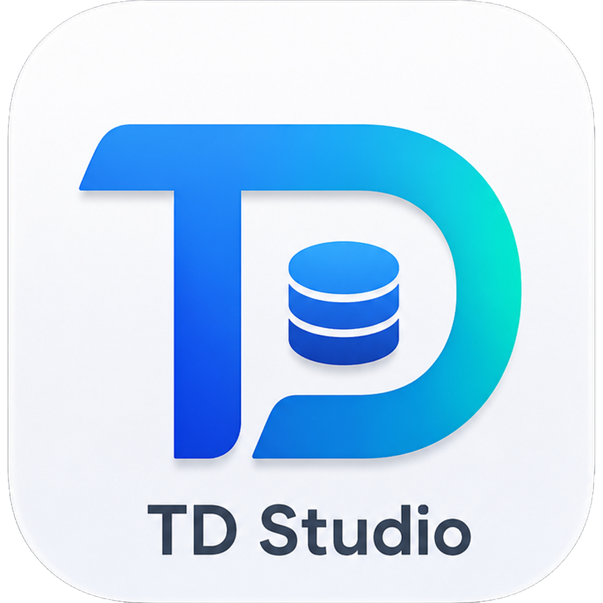
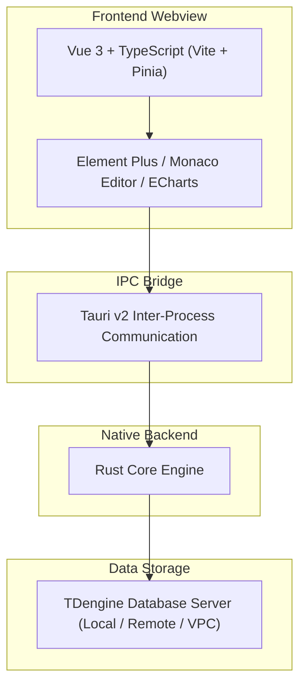

# TD Studio

**A Modern, Free & Local-First TDengine Desktop Client**

A modern, lightweight, local-first desktop database client for TDengine

  <a href="README.md">🇨🇳 中文</a> &nbsp;|&nbsp; 🇺🇸 English

  <a href="https://huangdungui.github.io/TD-Studio-Release/">🌐 Official Website</a> &nbsp;•&nbsp;
  <a href="https://huangdungui.github.io/TD-Studio-Release/#section-download">📥 Download</a> &nbsp;•&nbsp;
  <a href="https://github.com/huangdungui/TD-Studio-Release">📦 Release Repository</a>

---

## 📖 About TD Studio

**TD Studio** is a modern desktop database client purpose-built for **TDengine**.

Engineered specifically for time-series data exploration, SQL interaction, and day-to-day database operations, TD Studio is dedicated to delivering an intuitive, clean, and responsive desktop experience—empowering engineers and developers to manage and interact with TDengine databases with ease and efficiency.

- **Modern Desktop Experience**: Moving away from the heavy and dated look of traditional database management tools, offering a clean, comfortable, and intuitive user interface.
- **Local-First Architecture**: Database connections and operations run directly on your local machine without passing through intermediate cloud proxy servers, safeguarding data security.
- **Lightweight & High-Performance**: Built with modern native technologies, eliminating bulky runtimes to minimize memory consumption and maximize startup speed.

---

## ✨ Features

* 🖥️ **Modern Desktop UI**: Thoughtfully designed dark and multi-theme interfaces with balanced layout, clear visual hierarchy, and smooth interactions.
* 📝 **SQL Query & Execution**: Integrated with the professional Monaco Editor, supporting syntax highlighting, multi-line editing, and convenient query execution.
* 🗂️ **Database & Table Exploration**: Intuitive hierarchical tree view for browsing databases, Super Tables (STable), standard tables, sub-tables, column schemas, and tags metadata.
* 📊 **Query Result Inspection**: High-performance data grid for viewing query results, providing clear alignment for timestamps, metrics, and tags to facilitate comparison and troubleshooting.
* 💾 **Fast Data Export**: One-click export of SQL query results or table records to standard file formats such as CSV for offline analysis.
* 🔌 **Multi-Connection Management**: Seamlessly configure and switch between multiple TDengine instances (such as local development, staging clusters, and read-only production).
* 🚀 **Cross-Platform Native Performance**: Tailored and optimized for both macOS and Windows, delivering fast startup times and efficient system resource utilization.

---

## 🏗️ Architecture

TD Studio **does not use Electron**; instead, it is built on the modern **Tauri v2 + Rust + Vue 3** desktop application stack.

By leveraging operating system native webviews for UI rendering and Rust for low-level system operations and core logic, TD Studio significantly minimizes installation footprint and runtime memory overhead while retaining the flexibility and agility of the modern web ecosystem.

### Technology Stack

* **Desktop Framework**: [Tauri v2](https://v2.tauri.app/)
* **System Language**: [Rust](https://www.rust-lang.org/)
* **Frontend Framework**: [Vue 3](https://vuejs.org/) + [TypeScript](https://www.typescriptlang.org/) + [Vite](https://vitejs.dev/)
* **State Management**: [Pinia](https://pinia.vuejs.org/)
* **UI Components**: [Element Plus](https://element-plus.org/)
* **SQL Editor**: [Monaco Editor](https://microsoft.github.io/monaco-editor/)
* **Visualization**: [ECharts](https://echarts.apache.org/)

---

## 🛡️ Local-First & Privacy

TD Studio is built on the core principle of a "Local-First" architecture and deeply respects user data privacy:

* **Local-First**: Database connections and data transfers are initiated and completed directly between your local client and the target database.
* **No Cloud Proxy**: Connections between the client and TDengine are never proxied or relayed through any TD Studio cloud servers.
* **No Registration**: No account registration required—ready to use immediately upon download and installation.
* **No Login**: No login or authentication barrier required, fully functional offline.
* **No Data Upload**: TD Studio currently does not provide a user data upload feature and does not upload users' database business data, SQL content, or table schemas to TD Studio servers.
* **No Tracking**: TD Studio does not make collecting user behavioral data, building user profiles, or performing behavioral analytics a core feature.

---

## 🆓 Free Forever

**TD Studio is free-to-use closed-source software.**

In both current plans and long-term roadmaps, TD Studio does not plan to monetize through any of the following models:

* ❌ Software license fees
* ❌ Periodic subscriptions
* ❌ Paid Pro or Commercial tiers
* ❌ Feature-gating paywalls
* ❌ Charges based on database connection count
* ❌ User seat or concurrency limits

Whether for individual learning, developer debugging, or internal enterprise usage, **downloading, installing, and using TD Studio is completely free**.

---

## 📥 Download

We recommend downloading the latest release package directly from the official website:

👉 **[Visit TD Studio Official Website to Download](https://huangdungui.github.io/TD-Studio-Release/)**

You can also visit the [Releases Page](https://github.com/huangdungui/TD-Studio-Release/releases) in this repository for complete release history and checksum files.

### Supported Platforms

| Operating System | Architecture | Package Format | Notes |
| :--- | :--- | :--- | :--- |
| **macOS** | Apple Silicon (M1/M2/M3/M4 Series) | `.dmg` / `.app.tar.gz` | Native ARM64 architecture |
| **macOS** | Intel (x86_64) | `.dmg` / `.app.tar.gz` | Compatible with Intel-based Mac systems |
| **Windows** | x64 (64-bit) | `.exe` (Installer) | For Windows 10 / 11 64-bit |

> **Note**: Linux builds are currently in testing and refinement, and are not yet officially provided on the website.

---

## 🔄 Automatic Updates

TD Studio includes built-in support for in-app updates:

* **Lightweight Checking**: The client supports automatic or manual checks for the latest available releases.
* **Seamless Upgrades**: When a new version is released, existing users can quickly download and upgrade through guided in-app prompts.
* **Cryptographic Verification**: Powered by the Tauri Updater mechanism, all update distribution packages are verified against **digital signatures**, ensuring update integrity and safeguarding against tampering.

---

## ❤️ Sponsor

TD Studio is a free project developed and maintained independently by an individual developer in their spare time.

If TD Studio has improved your workflow or provided value to your projects, voluntary sponsorships are warmly appreciated. Sponsorship contributions help offset infrastructure costs such as continuous maintenance, platform code-signing certificates, and automated builds.

**Sponsorship Principles**:
* Sponsorship is entirely voluntary;
* Sponsoring does not unlock exclusive features or privileges;
* Not sponsoring will not impact your normal usage or future software updates;
* All users enjoy the full, unrestricted functional experience.

| WeChat Pay (微信支付) | Alipay (支付宝) |
| :---: | :---: |
|  |  |

Thank you to everyone who supports and follows TD Studio!

---

## ⚖️ Disclaimer

1. **Third-Party Independent Project**: TD Studio is a third-party TDengine client tool independently developed and maintained. It has **no affiliation, agency, official endorsement, authorization, or commercial partnership** with TDengine or its operating entities.
2. **Connectivity Statement**: TD Studio communicates with TDengine databases through the connection capabilities provided by TDengine. The product design, documentation statements, and released materials of TD Studio do not represent the official stance of TDengine.
3. **Trademark Notice**: TDengine® is a registered trademark of its respective owner. All trademarks and brand names mentioned herein belong to their respective holders and are used solely for factual, descriptive purposes regarding technical compatibility.

---

## 📦 Release Repository

This repository ([huangdungui/TD-Studio-Release](https://github.com/huangdungui/TD-Studio-Release)) is the **public distribution and release repository** for TD Studio, primarily serving to:

* 🚀 **Host Official Releases**: Distribute official binary installation packages for macOS and Windows;
* 📄 **Maintain Update Manifests**: Host in-app updater manifests (such as `latest.json`) and cryptographic signatures;
* 🌐 **Host Official Web Portal**: Host the official showcase and download site via GitHub Pages;
* 📢 **Publish Changelogs**: Document release notes and version history.

---

## 📄 License

**TD Studio is free-to-use closed-source software.**

The software can be downloaded, installed, and used without charge; however, **free to use does not mean open source**, nor does it grant users the right to use, modify, or redistribute the source code of TD Studio.

Unless otherwise expressly authorized in writing:

* **Source Code Rights Reserved**: All rights to the source code, program structure, and related proprietary content of TD Studio are reserved;
* **No Unauthorized Copying or Distribution**: You may not copy, modify, decompile, reverse-engineer, repackage, or redistribute the software without authorization;
* **No Commercial Resale**: You may not repackage or resell TD Studio as part of another commercial product or service for profit;
* **Free Does Not Mean Open Source**: While TD Studio is free to use, it does not grant any open-source license to its source code.

This public repository is intended solely for software releases, installer distribution, automatic update feeds, and related public informational materials, and does not represent an open-sourcing of the TD Studio source code.

---

  Copyright &copy; 2026 TD Studio. Dedicated to TDengine &middot; Independently Developed &middot; Free Forever

